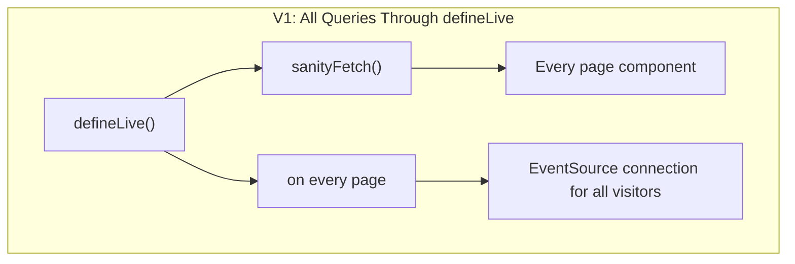
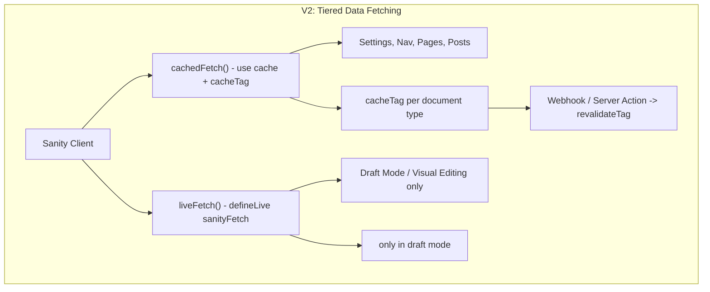
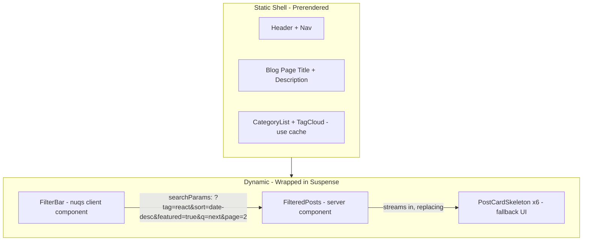

## 1. Problem Statement

Sanity Ignite v1 was built quickly during a push to release a starter kit owned by Fueled into the Sanity ecosystem. In the time since, Sanity’s APIs have advanced and other Agency starter kits are more proactively maintained.

Ignite for Sanity v2 will surmount to a sizeable and breaking update, that will bring it inline with the latest direction of Sanity and Next.js for content powered digital experiences.

The addition of a new landing page which speaks more loudly about the starter kits features and opinions, will help to solidify our position as Sanity experts.

### Technical Specifics

Sanity Ignite v1 was built during a period when `defineLive` / `SanityLive` was the recommended "default" approach for all data fetching in `next-sanity`. This decision coupled every single query in the application to the Live Content API, meaning:

- Every page render establishes a live connection, even for content that rarely changes (settings, navigation, static pages).
- The `SanityLive` component is rendered globally on every page, adding client-side JS and an EventSource connection for all visitors.
- There is no granular caching strategy -- no `revalidate`, no `unstable_cache`, no tag-based revalidation. Caching is entirely delegated to Sanity's CDN and the live system.
- The framework is on Next.js 15.2.8, missing the stable Cache Components / PPR features in Next.js 16+.
- TypeGen uses the legacy `sanity-typegen.json` config file and a custom `chokidar`based watcher (`watch-typegen.ts`) that is now unnecessary since TypeGen GA ships with built-in watch mode.

---

## 2. Proposed Changes

### 2.1 Upgrade Next.js 15 to Next.js 16.1

**Current:** `next@15.2.8`, `react@^19.0.0`

**Target:** `next@16.1.x`, `react@^19.x` (latest stable)

Key changes:

- Cache Components (`cacheComponents: true`) becomes available
- `use cache` directive, `cacheLife()`, `cacheTag()`, `revalidateTag()`, `updateTag()` become the primary caching primitives
- Partial Prerendering (PPR) is enabled automatically with `cacheComponents`
- `<Activity>` component for preserving state during navigation
- Turbopack file system caching is now stable (14x faster restarts)
- Route segment configs like `dynamic`, `revalidate`, `fetchCache` are superseded by the new model

**Migration in [next.config.ts](https://www.notion.so/fueled/next.config.ts):**

```tsx
const nextConfig: NextConfig = {
  cacheComponents: true,
  // ...existing config
};
```

### 2.2 Overhaul Data Fetching Architecture

This is the largest change. The goal is to **stop using `defineLive` / `sanityFetch` from `next-sanity` as the universal data fetcher** and instead build a purpose-built fetching layer that leverages Next.js 16 cache components properly.

### Current Architecture (v1)



Every query -- settings, navigation, page content, blog posts, metadata -- goes through `sanityFetch` from `defineLive`, and `SanityLive` runs on every page.

### Proposed Architecture (v2)



**Key design decisions:**

1. **Create a new `cachedFetch` wrapper** in [src/lib/sanity/client/fetch.ts](https://www.notion.so/fueled/src/lib/sanity/client/fetch.ts) that uses `use cache` + `cacheLife` + `cacheTag` for all production data fetching. This replaces `sanityFetch` from `defineLive` for published content.
2. **Reserve `defineLive` / `SanityLive` exclusively for draft mode / visual editing.** The `SanityLive` component should only render when draft mode is active, not globally.
3. **Implement tag-based revalidation** via a webhook endpoint (`/api/revalidate`) that receives Sanity GROQ-powered webhook payloads and calls `revalidateTag()` for the affected document types.
4. **Use `Suspense` boundaries** to enable PPR -- static shells render instantly while dynamic/personalised content streams in.

**Proposed `cachedFetch` utility:**

```tsx
import { cacheLife, cacheTag } from "next/cache";
import { client } from "./client";

export async function cachedFetch<T>(
  query: string,
  params?: Record<string, unknown>,
  options?: { tags?: string[]; life?: Parameters<typeof cacheLife>[0] },
) {
  "use cache";
  cacheLife(options?.life ?? "hours");
  if (options?.tags) {
    cacheTag(...options.tags);
  }
  return client.fetch<T>(query, params ?? {});
}
```

**Proposed layout change for [src/app/(frontend)/layout.tsx](<https://www.notion.so/fueled/src/app/(frontend)/layout.tsx>):**

Move `SanityLive` inside a draft-mode-only conditional:

```tsx
{
  isDraftMode && (
    <>
      <DraftModeToast />
      <VisualEditing />
      <SanityLive onError={handleError} />
    </>
  );
}
```

**New webhook revalidation route at `src/app/api/revalidate/route.ts`:**

Receives Sanity webhook payloads and calls `revalidateTag()` for affected document `_type` values. This closes the loop so content updates in Sanity Studio trigger cache invalidation without requiring live connections.

### 2.3 Implement Cache Components and PPR

With `cacheComponents: true` in Next.js 16, the rendering model changes:

- **Automatically static content:** Navigation, footer, settings -- these components can use `use cache` to be included in the static shell.
- **Cached dynamic content:** Blog posts, pages -- fetched from Sanity but cached with `cacheLife('hours')` and tag-based invalidation.
- **Streamed dynamic content:** Draft mode previews, personalized content -- wrapped in `<Suspense>` with fallback UI.

**Specific component changes:**

- **Header / Footer** (settings query): Currently fetched via `sanityFetch` on every request. Proposed: Use `cachedFetch` with `cacheTag('settings')` and `cacheLife('days')`. Part of the static shell.
- **Page sections**: Currently fetched via `sanityFetch`. Proposed: Use `cachedFetch` with `cacheTag('page', slug)` and `cacheLife('hours')`.
- **Blog posts**: Currently fetched via `sanityFetch`. Proposed: Use `cachedFetch` with `cacheTag('post', slug)`.
- **PageSections (client component with `useOptimistic`)**: Currently a client component for live optimistic updates. Proposed: Convert to server component for production; `useOptimistic` only used when draft mode is active. This removes unnecessary client JS for production visitors.

### 2.4 PPR Reference Implementation: Blog Archive with Nuqs

The `/blog` route becomes the flagship PPR example. The existing segment-based routes (`/category/[slug]`, `/author/[slug]`) are kept as canonical filtered views, but the main `/blog` page gains rich, query-param-driven filtering via [nuqs](https://nuqs.47ng.com/) -- demonstrating the full Cache Components + Suspense + React 19 async pattern.

**New dependency:** `nuqs` (~6 KB gzipped)

### Schema Changes

Add two new fields to the post schema in [src/studio/schema/documents/post.ts](https://www.notion.so/fueled/src/studio/schema/documents/post.ts):

```tsx
defineField({
  name: 'tags',
  title: 'Tags',
  type: 'array',
  of: [{ type: 'string' }],
  options: { layout: 'tags' },
  group: 'content',
}),
defineField({
  name: 'featured',
  title: 'Featured',
  type: 'boolean',
  initialValue: false,
  group: 'content',
}),
```

- `*tags**` (string array): Lightweight labels for granular filtering beyond reference-based categories. These are free-form strings that live on the document, not separate documents -- making them ideal for query-param filtering without needing their own URL segments.
- `*featured**` (boolean): Allows filtering to "featured posts only" -- a clean toggle filter example.

These fields are additive and non-breaking. Existing posts will have `tags: undefined` and `featured: undefined`, both handled gracefully by GROQ filtering.

### Extended GROQ Query

Extend `postsArchiveQuery` in [src/lib/sanity/queries/queries.ts](https://www.notion.so/fueled/src/lib/sanity/queries/queries.ts) to support the new filter dimensions:

```
*[
  _type == "post"
  && (!defined($filters.categorySlug) || references(*[_type == "category" && slug.current == $filters.categorySlug]._id))
  && (!defined($filters.personSlug) || references(*[_type == "person" && slug.current == $filters.personSlug]._id))
  && (!defined($filters.tag) || $filters.tag in tags)
  && (!defined($filters.featured) || featured == true)
  && (!defined($filters.q) || title match $filters.q + "*" || excerpt match $filters.q + "*")
] | order(
  select(
    $sort == "date-asc" => _createdAt asc,
    $sort == "title-asc" => title asc,
    $sort == "title-desc" => title desc,
    _createdAt desc
  ),
  _id desc
)
```

Also add a new query to fetch all available tags for the filter sidebar:

```
array::unique(*[_type == "post" && defined(tags)].tags[])
```

### Page Architecture with PPR

The `/blog` page is restructured to demonstrate the three PPR rendering tiers:



**Rendering tiers on `/blog`:**

1. **Static shell (pre-rendered at build):**

- Page heading, description, and layout chrome (Header/Footer already cached per 2.3)
- Category list sidebar -- fetched with `use cache` + `cacheTag('category')` + `cacheLife('days')`, included in the static shell since it doesn't depend on search params
- Available tags cloud -- same caching approach

1. **Client component (hydrates after shell):**

- `PostFilters` -- a Nuqs powered client component with `useQueryStates` for managing `tag`, `sort`, `featured`, `q` (search text), and `page` search params
- Uses `shallow: false` option to trigger server re-fetches when params change
- Uses `React.useTransition` for pending/loading states during filter changes

1. **Dynamic streamed content (Suspense boundary):**

- `FilteredPosts` -- an async server component that reads search params, calls `cachedFetch` with the filter params, and renders the post grid
- Wrapped in `<Suspense fallback={<PostGridSkeleton />}>` so the skeleton shows while results stream in
- Each filter combination produces a different cache entry (search params become part of the cache key)

### Key New Files

- `*src/lib/search-params.ts**` -- nuqs parser definitions shared between server and client:

```tsx
import {
  parseAsBoolean,
  parseAsInteger,
  parseAsString,
  createLoader,
} from "nuqs/server";

export const blogSearchParams = {
  q: parseAsString.withDefault(""),
  tag: parseAsString,
  sort: parseAsString.withDefault("date-desc"),
  featured: parseAsBoolean,
  page: parseAsInteger.withDefault(1),
};

export const loadBlogSearchParams = createLoader(blogSearchParams);
```

- `*src/components/modules/PostFilters.tsx**` -- client component with nuqs hooks:

```tsx
"use client";
import {
  useQueryStates,
  parseAsBoolean,
  parseAsString,
  parseAsInteger,
} from "nuqs";
import { useTransition } from "react";
import { blogSearchParams } from "@/lib/search-params";

export function PostFilters({ categories, tags }) {
  const [isPending, startTransition] = useTransition();
  const [filters, setFilters] = useQueryStates(blogSearchParams, {
    shallow: false, // triggers server re-render
    startTransition, // React 19 transition for loading states
  });
  // ... render filter controls with isPending for loading indicators
}
```

- `*src/components/modules/PostCardSkeleton.tsx**` -- skeleton loading UI matching the PostCard layout
- `*src/components/modules/PostGridSkeleton.tsx**` -- grid of PostCardSkeleton components
- `*src/app/(frontend)/blog/page.tsx**` -- restructured with PPR:

```tsx
import { Suspense } from "react";
import { loadBlogSearchParams } from "@/lib/search-params";
import { PostFilters } from "@/components/modules/PostFilters";
import { FilteredPosts } from "@/components/modules/FilteredPosts";
import { PostGridSkeleton } from "@/components/modules/PostGridSkeleton";
import type { SearchParams } from "nuqs/server";

// Cached: included in static shell
async function CategoryList() {
  "use cache";
  cacheLife("days");
  cacheTag("category");
  const categories = await client.fetch(allCategoriesQuery);
  return /* render category chips */;
}

async function TagCloud() {
  "use cache";
  cacheLife("days");
  cacheTag("post");
  const tags = await client.fetch(allTagsQuery);
  return /* render tag cloud */;
}

type PageProps = { searchParams: Promise<SearchParams> };

export default async function BlogPage({ searchParams }: PageProps) {
  return (
    <>
      <h1>Blog</h1> {/* Static shell */}
      <aside>
        <CategoryList /> {/* Cached in static shell */}
        <TagCloud /> {/* Cached in static shell */}
      </aside>
      <Suspense fallback={<PostGridSkeleton />}>
        <PostFilters /> {/* Client: hydrates with nuqs */}
        <FilteredPosts searchParams={searchParams} /> {/* Streams in */}
      </Suspense>
    </>
  );
}
```

### Consolidating Pagination

The current pagination uses nested route segments (`/blog/page/[page]`). With Nuqs, pagination moves to a `?page=N` search param on `/blog`. This means:

- **Remove** `src/app/(frontend)/blog/page/[page]/page.tsx` (segment-based pagination)
- Pagination is handled by the `page` search param via nuqs
- The `ArchivePagination` component updates to use nuqs `setFilters({ page: N })` instead of `<Link>` to `/blog/page/N`
- This is more natural for a filtered view -- changing a filter resets to page 1, and the full filter state is preserved in the URL

### Seed Data Considerations

To make the PPR demo compelling, seed data should include:

- At least 20-30 posts with varied categories, authors, tags, and dates
- Several posts marked as `featured: true`
- A mix of tags across posts (e.g., "react", "nextjs", "sanity", "typescript", "performance", "tutorial")
- Posts spanning multiple date ranges for sort ordering to be visible

If a seed script or Sanity dataset export exists, it should be updated to include the new `tags` and `featured` fields. Otherwise, document the expected seed data in the README.

### 2.5 Migrate TypeGen to GA Configuration

**Current setup:**

- [sanity-typegen.json](https://www.notion.so/fueled/sanity-typegen.json) -- legacy config file
- [watch-typegen.ts](https://www.notion.so/fueled/watch-typegen.ts) -- custom chokidar watcher (83 lines)
- Dev script: `npm-run-all --parallel --race next:dev watch-typegen`
- Dependencies: `chokidar`, `tsx`, `@types/chokidar`, `npm-run-all`

**Proposed setup:**

Move all TypeGen config into [sanity.cli.ts](https://www.notion.so/fueled/sanity.cli.ts):

```tsx
export default defineCliConfig({
  api: {
    projectId: clientEnv.NEXT_PUBLIC_SANITY_PROJECT_ID,
    dataset: clientEnv.NEXT_PUBLIC_SANITY_DATASET,
  },
  schemaExtraction: {
    enabled: true,
  },
  typegen: {
    enabled: true,
    path: ["./src/lib/sanity/queries/*.ts"],
    schema: "./.sanity/schema.json",
    generates: "./.sanity/sanity.types.ts",
    overloadClientMethods: true,
  },
});
```

**Files to delete:**

- `sanity-typegen.json`
- `watch-typegen.ts`

**Dependencies to remove:**

- `chokidar`
- `@types/chokidar`
- `npm-run-all` (no longer needed since `sanity dev` handles watch internally)

**Script changes in `package.json`:**

- `dev` simplifies to just `next dev --turbopack` (TypeGen watches are handled by Sanity CLI automatically during schema extraction)
- `build` runs `sanity schema extract && sanity typegen generate && next build`
- Remove `watch-typegen` script

**Note:** Since Ignite embeds the Studio inside the Next.js app (at `/studio`), we do NOT use `sanity dev`. The `typegen.enabled: true` flag runs during `sanity dev` and `sanity build`, but since we use `next dev`, we will use `sanity typegen generate --watch` as a parallel process, or potentially integrate into the Next.js dev command. This is a key consideration for the embedded studio pattern described in the [TypeGen GA blog post](https://www.sanity.io/blog/sanity-typegen-ga).

**Revised approach for embedded studio:**

```json
{
  "dev": "next dev --turbopack",
  "typegen:watch": "sanity typegen generate --watch",
  "sanity:extract": "sanity schema extract --path=.sanity/schema.json"
}
```

During development, run `sanity typegen generate --watch` separately or use `concurrently` (lighter than `npm-run-all`). This still removes the custom watcher but retains a parallel process.

### 2.6 Upgrade Sanity Packages

**Current versions -> Target versions:**

- `next-sanity`: `^9.9.6` -> `^12.x` (latest)
- `sanity`: `^3.81.0` -> latest stable
- `@sanity/vision`: `^3.81.0` -> latest stable
- `@sanity/image-url`: `^1.1.0` -> latest

**Breaking changes to address in next-sanity 12.x:**

- `defineLive` import path changed to `next-sanity/live`
- `useDraftModeEnvironment` deprecated in favour of `useVisualEditingEnvironment`
- `useIsPresentationTool` no longer requires `<SanityLive />`

### 2.7 Additional Improvements

**a) Add Suspense boundaries and `loading.tsx` files**
The current codebase has zero `<Suspense>` boundaries and no `loading.tsx` files. For PPR to work effectively, we need:

- `loading.tsx` in key route segments (`(frontend)/`, `blog/`, etc.)
- `<Suspense>` around dynamic content areas within pages

**c) Improve `PageSections` component architecture**
Currently [src/components/sections/PageSections.tsx](https://www.notion.so/fueled/src/components/sections/PageSections.tsx) is a `'use client'` component that uses `useOptimistic` for live preview updates. In v2:

- Create a server-side `PageSections` for production rendering
- Wrap in a client-side `LivePageSections` only when draft mode is active
- This reduces client JS bundle for all production visitors

**d) API version update**
Current: `NEXT_PUBLIC_SANITY_API_VERSION="2024-08-22"` -- update to `"2025-03-01"` or later.

- \*e) Evaluate removing `styled-components**`Sanity Studio requires`styled-components` (`^6.1.13`) as a peer dependency. Confirm this is still required with latest Sanity Studio or if it can be tree-shaken / isolated.

**f) Add proper error boundaries**
No `error.tsx` files exist in the route structure. Add these for production resilience.

**g) Consider `generateStaticParams` with Cache Components**
With PPR / Cache Components, the interaction between `generateStaticParams` and the new caching model should be reviewed. Dynamic route params may benefit from `cacheTag` instead of pure static generation.

---

## 3. Migration Risk Assessment

- **Data fetching overhaul (2.2):** HIGH risk -- touches every page and component. Requires thorough testing of both production and draft mode paths.
- **Next.js 16 upgrade (2.1):** MEDIUM risk -- major version upgrade. Cache Components is opt-in, reducing blast radius.
- **PPR blog refactor (2.4):** MEDIUM risk -- significant restructure of the blog archive, but isolated to `/blog` routes. Schema additions are non-breaking.
- **TypeGen migration (2.5):** LOW risk -- configuration change with clear migration path. Types stay the same.
- **Package upgrades (2.6):** MEDIUM risk -- next-sanity has breaking changes between v9 and v12.

---

## 4. New Landing Page

The home page should be redesigned from a generic "page builder demo" into a purpose-built landing page that serves two audiences:

1. **Developers evaluating the starter kit** -- they need to see what Ignite provides, how it's architected, and why it's better than rolling their own setup.
2. **Stakeholders and clients** -- they need to see that Fueled builds production-quality, performant, modern web experiences.

**Proposed landing page structure:**

- **Hero section:** "Ignite for Sanity" headline, sub-headline positioning it as Fueled's production-grade Sanity + Next.js framework. Clear CTAs: "Get Started" (links to GitHub/docs) and "View Demo" (links to demo site).
- **Tech stack showcase:** Visual badges/cards for Next.js 16, Sanity v3, TypeScript, Tailwind CSS 4, PPR/Cache Components. Brief copy on what each enables.
- **Feature highlights:** Key capabilities with icons/illustrations:
  - Cache Components and Partial Prerendering
  - Type-safe content with TypeGen GA
  - Visual Editing and Draft Mode
  - Tag-based cache revalidation
  - Modular page builder
  - Blog with search-param filtering (nuqs)
- **Architecture overview:** A simplified diagram (could be an SVG or embedded mermaid-style visual) showing the data flow: Sanity Content Lake -> cached fetch -> static shell + streamed dynamic content.
- **"Built by Fueled" section:** Agency branding block. Brief copy on Fueled's engineering philosophy, link to [fueled.com](http://fueled.com/), and optional client logos / social proof.
- **Footer:** Updated with Fueled branding, social links, and GitHub repo link.

This landing page content should be manageable in Sanity Studio (via the existing page builder), but the initial seed data should ship with compelling default content so the demo is impressive out of the box.

### Demo Site

The deployed demo site (likely on Vercel) should be a polished, content-rich instance that demonstrates all of Ignite v2's capabilities:

- **Landing page:** The new branded landing page described above.
- **Blog archive:** 20-30 seed posts with varied categories, authors, tags, and featured flags -- showing the PPR + nuqs filtering in action with visible skeleton loading states.
- **Individual blog post:** A well-formatted post demonstrating Portable Text rendering, author bylines, category badges, reading time, and cover images.
- **Dynamic page:** At least one additional page built with the page builder (e.g., an "About" page) to demonstrate the modular section system.

**Seed data approach:**

The demo site needs curated content that looks intentional, not lorem ipsum. Options:

- Write 20-30 short posts about web development, Sanity, Next.js, and related topics -- the content doubles as educational material for developers evaluating the kit.
- Include 4-5 categories (e.g., "Engineering", "Design", "Performance", "Content Strategy", "Tutorials").
- Use 3-4 author personas with profile images.
- Tag posts with a realistic spread of tags.
- Mark 5-6 posts as featured.

This seed data should be exportable as a Sanity dataset export (`.tar.gz`) or generated via a seed script, so anyone cloning the repo can optionally import the full demo content. Document this in the README.

### README Rewrite

The README should be fully rewritten for v2 to reflect:

- Fueled branding and positioning
- v2 architecture overview (Cache Components, tiered data fetching, TypeGen GA)
- Quick-start guide with seed data import instructions
- Clear "what's included" feature list
- Link to the live demo site
- Contributing guidelines under Fueled's open-source policy
- Acknowledgment of the v1 -> v2 breaking change with link to v1 branch

## 5. Versioning and Migration Policy

**Sanity Ignite v2 is a major breaking change. We do not recommend upgrading projects that are actively built on v1.**

v2 replaces the core data fetching layer, caching architecture, and rendering model. These are not incremental improvements that can be adopted piecemeal -- they are fundamental changes to how the framework works:

- The entire `defineLive` / `sanityFetch` data fetching pipeline is replaced with a `use cache` + tag-based revalidation model.
- Next.js 16 Cache Components and PPR change the rendering contract for every page and layout.
- The blog archive routes are restructured (segment-based pagination replaced with search-param-based).
- TypeGen configuration and tooling is fully replaced.

**For teams currently shipping on v1:**

- v1 remains functional and supported for existing projects. Sanity's Live Content API and Next.js 15 are not going away.
- There is no automated migration path from v1 to v2. The architectural differences are too substantial for codemods.
- If a v1 project wants to adopt specific v2 patterns (e.g., adding `use cache` to a few components), they can do so incrementally by upgrading Next.js and following the Cache Components docs independently -- but that is outside the scope of Ignite.

**For new projects:**

- All new projects should start on v2.
- v2 is the actively maintained version going forward.

This is standard practice for starter kits and framework templates. The purpose of Ignite is to provide the best starting point at a given moment in time, not to maintain backward compatibility across major platform shifts.

---

## 6. Key Files Affected

**Config & infrastructure:**

- [next.config.ts](https://www.notion.so/fueled/next.config.ts) -- add `cacheComponents: true`
- [sanity.cli.ts](https://www.notion.so/fueled/sanity.cli.ts) -- add TypeGen + schema extraction config
- [package.json](https://www.notion.so/fueled/package.json) -- dependency upgrades (add `nuqs`), script changes
- [sanity-typegen.json](https://www.notion.so/fueled/sanity-typegen.json) -- DELETE
- [watch-typegen.ts](https://www.notion.so/fueled/watch-typegen.ts) -- DELETE

**Data fetching layer:**

- [src/lib/sanity/client/live.ts](https://www.notion.so/fueled/src/lib/sanity/client/live.ts) -- scope to draft mode only
- [src/lib/sanity/client/fetch.ts](https://www.notion.so/fueled/src/lib/sanity/client/fetch.ts) -- NEW: cached fetch wrapper
- [src/app/(frontend)/layout.tsx](<https://www.notion.so/fueled/src/app/(frontend)/layout.tsx>) -- conditional `SanityLive`
- [src/app/api/revalidate/route.ts](https://www.notion.so/fueled/src/app/api/revalidate/route.ts) -- NEW: webhook revalidation
- All page files in `src/app/(frontend)/` -- switch from `sanityFetch` to `cachedFetch`

**Schema & queries:**

- [src/studio/schema/documents/post.ts](https://www.notion.so/fueled/src/studio/schema/documents/post.ts) -- add `tags` and `featured` fields
- [src/lib/sanity/queries/queries.ts](https://www.notion.so/fueled/src/lib/sanity/queries/queries.ts) -- extend `postsArchiveQuery` with new filters, add `allTagsQuery`
- [src/lib/sanity/queries/fragments/fragments.ts](https://www.notion.so/fueled/src/lib/sanity/queries/fragments/fragments.ts) -- update `postCardFragment` to include `tags` and `featured`

**PPR blog reference implementation (NEW files):**

- `src/lib/search-params.ts` -- nuqs parser definitions (shared server/client)
- `src/components/modules/PostFilters.tsx` -- nuqs client filter component
- `src/components/modules/FilteredPosts.tsx` -- async server component for filtered results
- `src/components/modules/PostCardSkeleton.tsx` -- skeleton loading UI
- `src/components/modules/PostGridSkeleton.tsx` -- skeleton grid wrapper

**PPR blog refactored files:**

- [src/app/(frontend)/blog/page.tsx](<https://www.notion.so/fueled/src/app/(frontend)/blog/page.tsx>) -- restructured with PPR + nuqs + Suspense
- `src/app/(frontend)/blog/page/[page]/page.tsx` -- DELETE (pagination moves to `?page=N`)
- [src/components/modules/ArchivePagination.tsx](https://www.notion.so/fueled/src/components/modules/ArchivePagination.tsx) -- update to use nuqs `setFilters` instead of `<Link>`
- [src/components/templates/PostRiver.tsx](https://www.notion.so/fueled/src/components/templates/PostRiver.tsx) -- update to work with new pagination model

**Component architecture:**

- [src/components/sections/PageSections.tsx](https://www.notion.so/fueled/src/components/sections/PageSections.tsx) -- server/client split
